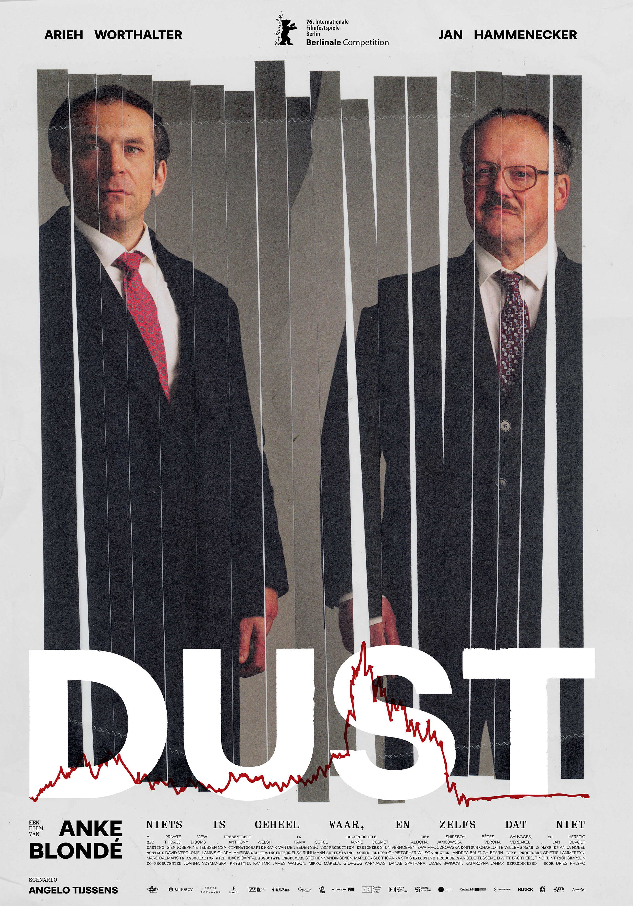

Flanders Fields is famous for its Great War battlefields and rows of red poppies. But in the nineties, Ypres was also the epicenter of the emerging field of speech technology, with "Lernout & Hauspie" ("L&H") as the star company of "Flanders Language Valley", a name coined after "Silicon Valley". 

The movie Dust (2026), directed by Anke Blondé and starring Arieh Worthalter and Jan Hammenecker, is an unofficial portrayal of the demise of Lernout & Hauspie as it collapsed into bankruptcy in November 2000. *Dust* is clearly inspired by historical events, although there are no explicit historical references to L&H. 

If one doesn't know anything about the historical events that the movie is based on, one can still enjoy the movie. However, the similarity between the movie and the historical events is undeniably there, and for those who do recognize the historical references, this similarity yields an effect. 

The cognitive act of recognition is essentially an iconic act. For instance, failing to recognize a face is because the similarity has no cognitive effect, not because there is no similarity. In other words, similarity is the resemblance between a sign and its object, whereas iconicity is the effect that this resemblance has on the interpretant of the sign. To me the difference between similarity and iconicity (the effect) has always been a fundamental distinction, as I explain in De Cuypere [-@DeCuypere2026OUP].

::: {.callout-note}
Some basic semiotic theory. An iconic sign is a sign that refers to something else, its referent, based on some kind of similarity between the sign and the referent. This is one of three kinds of signs distinguished in the semiotic theory developed by Charles Sanders Peirce (1839–1914). The other two signs are the "symbol" -- a sign that refers to a referent based on some arbitrary convention -- and the "index" -- a sign that refers to a referent based on some causal or contiguous relationship.
:::

The poster of *Dust* is a semiotic gem, a feast of intertextual and iconic references. I dont know who created this poster, but congratulations to whoever did such a fine job. 

Several iconic references can be identified. Allow me to dissect the poster and to breathe life into the latent resemblances.  

The poster depicts the two middle-aged male protagonists. They look grumpy, wear dark suits and sport colorful ties; the sartorial 1990s CEO apparel, before techbros introduced jeans, sneakers, and the rolling collar or hoodie.

The name "Dust" evokes "ashes to ashes, dust to dust." *Dust* also reflects *(going) bust* or the *burst of a bubble*. Iconicity galore, and there's more. 

The word *dust* is also the West-Flemish dialect word for the Dutch word *dorst* (West-Flemish is a dialect of Dutch). *Dorst* is the Dutch cognate of the English *thirst*; *thirsty for more*, the entrepreneurial spirit. In West Flanders, it is not uncommon to see a signpost at a gathering saying *we’n dust* -- literally *we have thirst*. You wave it to call a waiter.

At the bottom of the poster, a red line graph mimicks a fictional stock tracker. The red line climbs during the *thirsty* period and then falls as the company goes *bust*, or turns into *dust*. 

Notice that the red line goes completely flatline under the letter *T*. Is it my imagination, or do I hear -- or even phonotactically feel -- the flatline in the pronunciation of the sound [t]? 

Is my interpretation "correct"? Or is this what Umberto Eco [-@eco1992interpretation] meant with "overinterpretation"?  

My interpretation might only be in mine eye as the beholder. It might not have been what the writer intended (the "intentio auctoris" in Eco's terminology). It might not be in line with the interpretation of other readers. But I'm perfectly fine with that. However, it would be problematic to claim that my interpretation is part of the meaning of *dust*. And this is exactly the problem I have with psycholinguistic rating experiments that aim to measure the iconicity of the lexicon. More on this in De Cuypere [-@DeCuypere2026OUP].

Let's move on to the the photograph of the two men on the poster. Note that the photograph is ripped into pieces, as if it went through a paper shredder, after which the photograph was puzzeled back together. There are multiple iconic interpetations possible. The shredded photograph might reflect the broken relationship between the two protagonists. Or it might resemble the broken dreams of days gone by, or perhaps even the fragmented memories one has of historical events. The shredded picture could even suggest a kind of multiverse historical rendering: the past can only be reconstructed, and any reconstruction necessarily falls short of what really happened.

Which brings me to the tagline at the bottom of the picture: *misschien is niets geheel waar, en zelfs dat niet*. This is a quote by the 19th-century Dutch writer Multatuli (the name is not explicitly mentioned on the poster). The line can be translated as: *Maybe nothing is completely true, and not even that*. There is no perfect rendering of reality. The perfect iconic sign does not exist. A picture can only be a two-dimensional rendering of the real thing. This relates to a (very) short story by Jorge Luis Borges ("Del rigor en la ciencia"), which argues that the perfect map of an empire would have to be the size of the empire itself, at which point the sign becomes the object. Asymptotically, the iconic sign is imperfect until it becomes the object it refers to; the paradox faced by any scientific model of reality!

You might wonder what happened to the speech technology of those brave little Belgians who went from "dust to bust" (technology acquired by acquisition, I should add). It’s currently owned by Microsoft and worth billions. 

Time to wrap up. Or as we say in West-Flanders: *k'i der dust van gekrégn*, lit. "I have become thirsty of this".  

