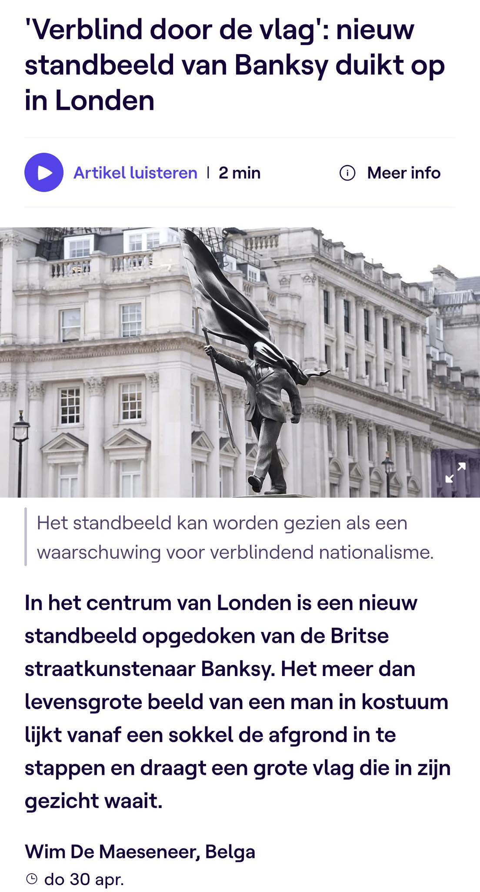
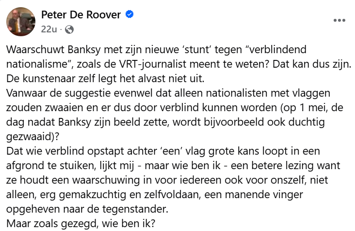
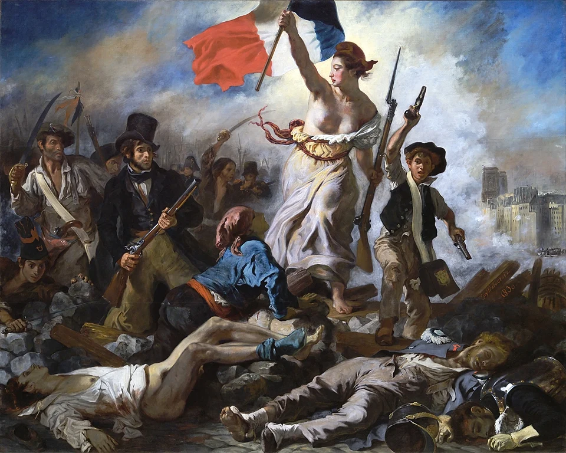

Ik had het in mijn vorige blogpost ([Blog Stay](https://ludovicdecuypere.github.io/posts/26-05-01-stay/)) nog maar net over de verschillende manieren waarop een kunstwerk geïnterpreteerd kan worden, en vandaag dient zich al een interessante casus aan.

Peter De Roover reageert op Facebook op een bericht op de VRT‑website waarin het nieuwe standbeeld van Banksy wordt geïnterpreteerd als een “waarschuwing voor verblindend nationalisme”. Ik deel hier het VRT‑bericht; de gesuggereerde interpretatie staat als bijschrift onder de afbeelding van het nieuwe kunstwerk.

{width="338"}

Peter De Roover vraagt zich terecht in zijn Facebookreactie af waarom deze interpretatie zich uitsluitend op “nationalisten” zou richten. Zoals hij opmerkt, zijn het niet alleen nationalisten die met vlaggen zwaaien. Bovendien verscheen het kunstwerk daags vóór 1 mei, een dag waarop socialisten traditioneel met vlaggen zwaaien tijdens de Dag van de Arbeid. Ik deel hier zijn reactie:

{width="439"}

Het kunstwerk is “poly‑interpretabel”: het laat meerdere interpretaties toe. Zoals ik in mijn vorige blogpost heb toegelicht, bestaan er verschillende visies op wat een “correcte” interpretatie van een kunstwerk is.

Peter De Roover wijst onder meer op de intentie van de kunstenaar zelf, en stelt dat we die zonder verdere toelichting van de kunstenaar niet kunnen achterhalen. Dat klopt. Daarnaast kan ook de toeschouwer interpretaties ontwikkelen die niet noodzakelijk samenvallen met de oorspronkelijke bedoeling van de kunstenaar, maar wel met de intenties van het kunstwerk zelf.

Dat het standbeeld van Banksy uitsluitend over nationalistische vlaggen zou gaan, lijkt me ook een nogal enge lezing. Het lijkt eerder een waarschuwing tegen alle vormen van blinde adoratie van macht - vlaggen kunnen verblinden.

Het kunstwerk van Banksy doet mij denken aan *La Liberté guidant le peuple* van Eugène Delacroix (18).

Het standbeeld van banksy is een quasi totale omkering van het schilderij van Delacroix.

Het standbeeld is donker en grijs, in het schilderij spatten de kleuren ervan af.

De vlag baadt in het licht, bij Banksy verblindt de vlag zowel de vlaggendrager, maar ook ons als toeschouwer; we zien immers het gezicht niet.

Bij banksy werkt de vlag dus verblindend, bij Delacroix verbindend en bevrijdend (althans als we dat zo interpreteren).

Bij Banksy wandelt een man in maatpak - de macht - blindelings de afgrond in. Bij Delacroix stapt de vrouw met ontblote borst - de vrijheid - trots vooruit, al gaat ze daarbij letterlijk over lijken. Inderdaad, ook tijdens de Franse revolutie ging de blinde adoratie voor de vlag gepaard met atrociteiten en blind geweld tegen diegene die dezelfde vlag niet deelden.

Banksy plaats zich met zijn standbeeld en de afbeelding van de vlag in een lange kunsttraditie waarin vlaggen worden afgebeeld.

Vlaggen dekken verschillende ladingen. Ook het nieuwe kunstwerk van Banksy laat zich op verschillende manieren interpreteren.
