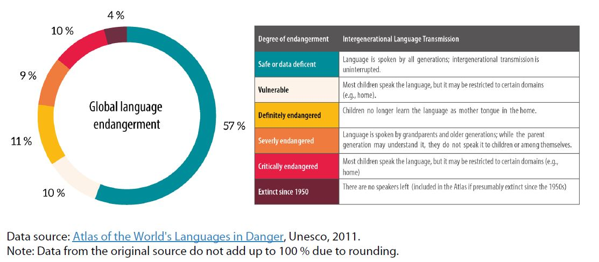

### Talen van de wereld

Er zijn naar schatting tussen de 6000 à 8000 talen in de wereld. Een twintigtal talen wordt gesproken door ongeveer 3,6 miljard mensen, maar bijna de helft van alle talen is met uitsterven bedreigd.

Een taal sterft zodra die niet meer gesproken wordt of doorgegeven naar de volgende generatie. Er zijn heel wat talen die nog maar door een handvol mensen gesproken worden. Die talen zullen verdwijnen zodra de sprekers sterven. En zonder geschreven of gesproken opnames is zo'n taal voorgoed verdwenen.

Hoeveel talen exact met uitsterven bedreigd zijn, is lastig in te schatten. Dat heeft dezelfde reden waarom het aantal talen ter wereld zo moeilijk te tellen is: wat verstaan we nu eigenlijk onder een "taal"?

De gestandaardiseerde talen, zoals het standaard Nederlands, zijn ongetwijfeld talen; officiële talen zijn per definitie niet bedreigd. Maar is het Vlaams een taal? En zijn het West-Vlaams of het Limburgs talen? Is het Izegems een taal? Tellen we dialecten mee in een lijst van de talen van de wereld?

Om het aantal talen van de wereld en het aantal bedreigde talen te tellen, moeten we overeen komen welke talen we gaan meetellen en daarvoor moeten we eerst weten wat we verstaan onder een taal. Daar bestaat helaas geen eenduidig antwoord op.[^1]

[^1]: We beschikken over twee bronnen met ruwe schattingen: [Ethnologue](https://www.ethnologue.com/insights/how-many-languages/) en [Glottolog](https://glottolog.org/).

::: callout-note
## Talen tellen

In de wetenschap wordt het volgende stappenplan gebruikt:

idee \> theoretisch concept –\> meetbare variabele

Sprekers van een taal hebben een intuïtief idee van wat een "taal" is en wat het betekent om een taal te spreken. Maar dat is niet precies genoeg. We moeten dit idee ook zo nauwkeurig mogelijk definiëren; helaas bestaat er geen eenduidige definitie waar alle taalwetenschappers het over eens zijn. Vervolgens moeten we meetbare criteria opstellen – het concept operationaliseren – om zo objectief mogelijk te bepalen wat een taal is, zodat we accuraat mogelijk kunnen tellen. In het geval van officiële talen maakt het criterium "officieel" het concept "taal" gemakkelijk meetbaar. Maar voor niet-officiële talen is dit niet zo evident.

De definitie van "taal" is nooit op louter talige kenmerken gebaseerd, maar ook op sociale en culturele eigenschappen van de taalgemeenschap. De definitie van Ethnologue is gebaseerd op twee criteria: onderlinge verstaanbaarheid en het delen van een ethnolinguïstische identiteit (een gemeenschappelijke literatuur bijvoorbeeld).
:::

Om discussie over de term "taal" te vermijden, gebruiken taalwetenschappers tegenwoordig soms ook de term "languoid". Een languoid is een taal of taalvariant die door een groep sprekers gedeeld wordt, los van de status ervan:

> "A cover term for any type of lingual entity: language, dialect, family, language area, etc. It is roughly similar to the term taxon from biological taxonomy, except it is agnostic as to whether the relevant linguistic grouping is considered to be genealogical or areal (or based one some other possible criteria for grouping languages)."
>
> Good & Hendryx-Parker [-@goodhendryx_2006, p. 6]

Door de naam en de definitie ervan te veranderen is het telprobleem natuurlijk niet opgelost. Als we elke "languoid" zouden tellen, dan zouden het er ongetwijfeld meer dan 8000 talen zijn. Een intervalschatting - tussen de 6000 en 8000 talen - is in ieder geval accurater dan een puntschatting; we kunnen het aantal talen onmogelijk exact bepalen.

### Bedreigde talen

De helft van alle gesproken talen zijn in meer of mindere mate bedreigd. Unesco maakt een onderscheid tussen vijf graden van bedreiging, zoals aangeduid in @fig-unesco-bedreigd. De figuur geeft ook een schatting van de bedreigde talen binnen elke categorie.

{#fig-unesco-bedreigd}

### Data

In wat volgt, maak ik met de software R [@R2026] een kaart met bedreigde talen op basis van een dataset die werd samengesteld voor een datablog in de Britse krant *The Guardian* in 2011 [datablog](https://www.theguardian.com/news/datablog/2011/apr/15/language-extinct-endangered#data). De dataset heb ik gedownload van de website *Kaggle*. [Data](https://www.kaggle.com/datasets/the-guardian/extinct-languages).

Wie niet geïnteresseerd is in R-code, kan onmiddellijk naar beneden scrollen naar de wereldkaart met de bedreigde talen. Voor een uitgebreidere uitleg bij de R-code verwijs ik graag naar mijn online tutorial in [LADAL](https://ladal.edu.au/tutorials/leaflet/leaflet.html).

We beginnen met het inlezen van de dataset, die beschikbaar is in .csv-formaat:

```{r}
#| echo: false
#| warning: false
library(flextable)
library(tidyverse)
library(leaflet)
```

```{r}
endan <- read.csv("data.csv")
```

De dataset bevat onder meer variabelen met de namen van de talen die bedreigd zijn, de mate waarin die talen bedreigd zijn, en coördinaten voor de plaats waar de taal gesproken wordt.

We selecteren de variabelen die we nodig hebben om de kaart te maken; ik vereenvoudig tegelijk ook de namen van de variabelen.

```{r}
endan <- subset(endan, select = c(Name.in.English, Degree.of.endangerment, Latitude, Longitude))
endan <- endan |> rename(
  Language = Name.in.English,
  Endangered = Degree.of.endangerment
)
```

De variabele `Endangered` veranderen we naar een factor, met een rangorde in de categorieën:

```{r}
endan$Endangered <- as.factor(endan$Endangered) 
endan$Endangered <- factor(endan$Endangered, 
                           levels = c("Vulnerable",
                                    "Definitely endangered",
                                    "Severely endangered",
                                    "Critically endangered",
                                    "Extinct"))
```

Hier is een sample van 10 rijen uit de data die we nu ter beschikking hebben.

```{r}
#| echo: false
#| warning: false
endan |> slice_sample(n = 10) |>
  flextable() |>
  flextable::set_table_properties(width = .5, layout = "autofit") |>
  flextable::theme_zebra() |>
  flextable::fontsize(size = 12) |>
  flextable::fontsize(size = 12, part = "header") |>
  flextable::align_text_col(align = "center") |>
  flextable::set_caption(caption = "")  |>
  flextable::border_outer()
```

We kunnen alvast een samenvatting maken van het aantal bedreigde talen binnen verschillende graden van bedreiging:

```{r}
endan |> count(Endangered) |> mutate(
  Prop = round(n/sum(n)*100, 0)
)
```

Van alle talen die bedreigd zijn – dus niet van alle gekende talen! – staan er 607 (22%) op het punt om te verdwijnen ("Critically endangered").

### Kaart {#sec-kaart}

We maken nu de interactieve wereldkaart.

Ik maak eerste een kleurenpallet om de verschillende graden van bedreiging weer te geven.

```{r}
col <- c("#F4E7D3",    # Vulnerable
         "orange",     # Definitely endangered
         "#E65100",    # Severely endangered
         "red",        # Critically endangered 
         "purple4"     # Extinct
         ) 
color_pal_WALS <- colorFactor(palette = col, 
                         levels = c("Vulnerable",
                                    "Definitely endangered",
                                    "Severely endangered",
                                    "Critically endangered",
                                    "Extinct"))
```

De volgende code creëert een interactieve kaart. Elk punt stelt een bedreigde taal voor. De verschillende graden van bedreiging worden als kleuren weergegeven. Je kunt ook inzoomen om bepaalde gebieden meer in detail te bekijken.

```{r}
#| warning: false
leaflet(endan) |>           
  addTiles()  |>          
  addCircleMarkers(       
    ~Longitude, ~Latitude, 
    fillColor = ~color_pal_WALS(Endangered),
    color = "white", 
    radius = 4,      
    fillOpacity = 1, 
    stroke = TRUE,   
    weight = 1.2,       
    label = ~Language, 
    popup = ~paste("<strong>Language:</strong>", Language,
                   "<br><strong>Degree of Endangerment:</strong>", Endangered)
  ) |>
  addLegend("topright",    
            pal = color_pal_WALS, 
            values = ~Endangered, 
            title = "Degree of Endangerement",
            opacity = 0.9)
```

Talen van over de hele wereld zijn met uitsterven bedreigd; geen enkele regio blijft gespaard.

Als je inzoomt naar België, zul je zien dat er één taal is die volgens deze dataset bedreigd is: Walloon (de Waalse variant van het Frans). Tiens, is Walloon een taal?

Opnieuw zien we hoe moeilijk het is om een specifiek nummer te plakken op het aantal talen in de wereld en op het aantal bedreigde talen. Alles hangt af van hoe "taal" gedefinieerd wordt. Maar dat er veel talen of "languoids" zullen verdwijnen, zoveel is zeker.
