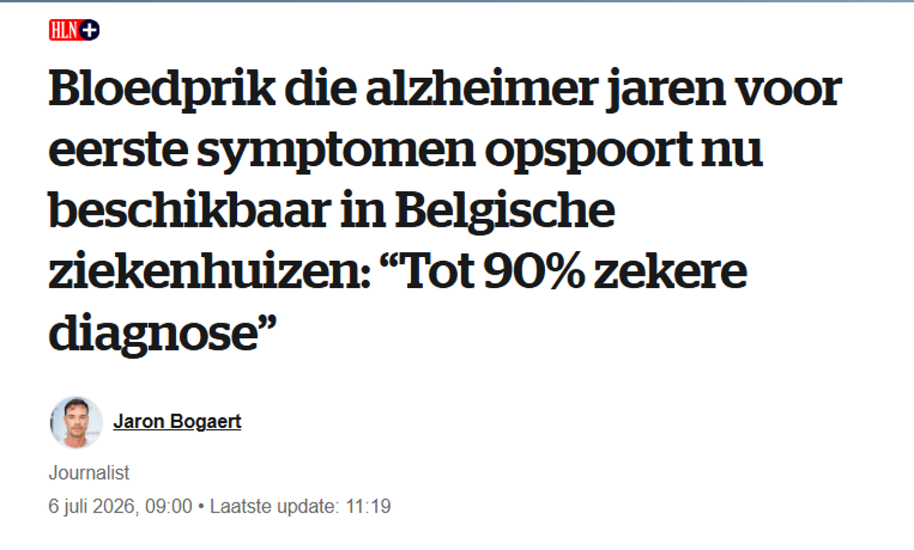

Onlangs verscheen in de krant *Het Laatste Nieuws* het bericht dat er een nieuwe test bestaat die alzheimer met 90% zekerheid kan voorspellen nog voor de eerste symptomen zichtbaar zijn:

Stel: een man van 75 jaar met enkele ouderdomskwaaltjes, maar zonder geheugen- of oriëntatieproblemen, laat deze test uitvoeren en de test is positief. "Positief" betekent dus dat de man volgens de test alzheimer heeft, of althans een stofje in het bloed dat erop wijst. Een donderslag bij heldere hemel. Wie had dit kunnen vermoeden? De man leek kerngezond en nu is hij ziek - of zo goed als. Gelukkig zijn we er vroeg bij!

Maar wat is dan de kans dat die man ook daadwerkelijk alzheimer heeft?

Veel mensen zullen antwoorden: $90\%$. Maar dit is een verkeerd antwoord.

De titel van het artikel is nochtans duidelijk: de bloedtest spoort alzheimer op vóór de eerste symptomen. "TOT 90% ZEKERE DIAGNOSE". Als de test zo goed is, dan zal die man toch wel alzheimer hebben? Toch niet.

De kans dat een gezonde 75-jarige man zonder symptomen bij een positieve test effectief alzheimer heeft, is veel kleiner dan $90\%$. Ik zal aantonen dat die kans dichter bij $50\%$ ligt en eerder nog wat lager.

Dit heeft te maken met het volgende verschil:

*De kans dat een test positief is wanneer iemand de ziekte heeft, is niet gelijk aan de kans dat iemand de ziekte heeft wanneer de test positief is.*

Het onderscheid is subtiel, maar fundamenteel.

De $90\%$ slaat op de kwaliteit van de test en is niet gelijk aan de kans om de ziekte te hebben bij een positief resultaat.

Een zekerheid van $90\%$ betekent dat wanneer iemand effectief de ziekte heeft, de test dit in $90\%$ van de gevallen correct aanwijst (en in $10\%$ van de gevallen dus verkeerd). Dit wordt de "sensitiviteit" van de test genoemd. De "specificiteit" van een test is het omgekeerde: de kans dat de test negatief is als de ziekte niet aanwezig is. Laten we er gemakshalve verder van uitgaan dat die specificiteit ook gelijk is aan $90\%$.

Maar een sensitiviteit van $90\%$ betekent niet dat bij een positief testresultaat de kans op de ziekte ook $90\%$ is.

Om de kans te berekenen dat een 75-jarige man zonder geheugenproblemen effectief alzheimer heeft, moeten we rekening houden met de kans die de man sowieso al heeft op alzheimer - zijn "basiskans".

Indien die man geen symptomen vertoont en verder ook geen familiegeschiedenis van alzheimer heeft, dan zouden we niet verwachten dat hij de ziekte heeft. Of we zouden die kans in ieder geval heel laag inschatten.

We kunnen die kans inschatten door te kijken naar hoeveel gezonde mannen van 75 jaar alzheimer hebben. Dit wordt de "prevalentie" genoemd: het voorkomen van de ziekte bij alle mannen van 75 jaar. Stel nu dat die kans $10\%$ is (het is in werkelijkheid iets lager, maar 10% rekent gemakkelijker).

We moeten nu die $10\%$ combineren met de $90\%$ van de test.

Daarvoor bestaat een formule op basis van de regel van Bayes:

$$P(\text{heeft de ziekte} \mid \text{test is positief}) = \frac{P(\text{test is positief} \mid \text{heeft de ziekte}) \times P(\text{heeft de ziekte})}{P(\text{test is positief})}$$

"P" staat voor kans (probability), en "\|" staat voor "gegeven dat" of "als we weten dat".

Deze formule geeft weer wat ik hierboven geschreven heb:

*De kans dat een test positief is wanneer iemand de ziekte heeft, is niet gelijk aan de kans dat iemand de ziekte heeft wanneer de test positief is.*

$$P(\text{heeft de ziekte} \mid \text{test is positief}) \neq P(\text{test is positief} \mid \text{heeft de ziekte})$$

In de formule zien we verder dat we rekening moeten houden met de kans op de ziekte en de kans op een positief resultaat. Dat positieve resultaat omvat zowel correct-positieve resultaten als vals-positieve resultaten (vals-positief betekent dat de test positief is, maar dat de ziekte niet aanwezig is).

Ik vul nu de formule in met percentages en bereken de kans dat onze 75-jarige man (met een verwachte kans van $10\%$ op alzheimer) inderdaad alzheimer heeft op basis van een test die $90\%$ correct is:

$$P(\text{heeft de ziekte} \mid \text{test is positief}) = \frac{0.90 \times 0.10}{(0.90 \times 0.10) + (0.10 \times 0.90)} = 0.50$$

Die kans is dus $50\%$!

Geen $90\%$ zoals men zou kunnen vermoeden bij een test met een "90% zekere diagnose".

Stel dat we dezelfde test uitvoeren bij een jonge, gezonde vrouw van 40 jaar met een heel lage kans op alzheimer van $0.5\%$. Zij heeft *bij een positief testresultaat* slechts $4\%$ kans om effectief alzheimer te hebben.

Maar stel nu dat een verwarde man met duidelijke symptomen de test laat afnemen, en men er al vrij zeker van is dat er sprake is van alzheimer. We zetten de basiskans in dat geval op $60\%$. Dan wordt de kans dat die man effectief alzheimer heeft gelijk aan $93\%$. Een sterke bevestiging van een zeer concreet vermoeden. In dergelijke gevallen bewijst de test absoluut zijn nut.

Belangrijkste conclusie: 90% betekent voor iedereen iets anders!

De noemer in de formule, $P(\text{test is positief})$, is de totale kans op een positief testresultaat. Er zijn zowel tests die positief zijn bij mensen die effectief ziek zijn (de correct-positieven) als tests die positief zijn bij mensen die niet ziek zijn (de vals-positieven). Die laatste groep wordt al snel heel groot als je een dergelijke test zou gebruiken als algemene screening.

Onderstaande tabel toont de verdeling voor testresultaten in een hypothetische groep van 1000 mensen, waarvan $10\%$ effectief alzheimer heeft en met testresultaten voor een test met $90\%$ correcte diagnose (sensitiviteit en specificiteit).

|   | heeft alzheimer | heeft geen alzheimer | Totaal |
|--------------|:--------------------:|:---------------------:|------------------|
| test is positief | 90 (90%) (correct-positief) | 90 (10%) (vals-positief) | 180 |
| test is negatief | 10 (10%) (vals-negatief) | 810 (90%) (correct-negatief) | 820 |
|  | 100 (10%) (prevalentie) | 900 (90%) | 1000 |

De noemer is de som van het aandeel correct-positieven en het aandeel vals-positieven: dat zijn de $180$ mensen in de tabel, ofwel $180/1000 = 18\%$.

- Correct-positief: $10\%$ van de mensen is ziek en de test vindt daar $90\%$ van = $(0.10 \times 0.90) = 9\%$
- Vals-positief: $90\%$ van de mensen heeft geen alzheimer, maar toch heeft volgens de test $10\%$ daarvan wel alzheimer = $(0.90 \times 0.10) = 9\%$
- P(positief) = $(0.10 \times 0.90) + (0.90 \times 0.10) = 0.18 = 18\%$

Het is verleidelijk om een $90\%$ correcte diagnose te interpreteren als de kans om een ziekte te hebben wanneer de test positief is. Deze denkfout wordt ook wel de "base rate fallacy" of de "basiskansfout" genoemd, omdat je geen rekening houdt met de verwachte kans die aan de basis ligt van de ziekte.

Een test met een "tot 90 procent zekere diagnose" betekent niet dat het 90% zeker is dat je de ziekte hebt als de diagnose positief is. Een positief resultaat betekent immers voor iedereen iets anders. Vandaar ook het belang van een deskundige arts die de resultaten correct kan toelichten. Alles is taal en communicatie.

De redeneringsfout raakt ook aan de kern van het probleem bij elke screeningstest voor zeldzame ziektes: hoe zeldzamer de ziekte, hoe beter de test moet zijn om de ziekte betrouwbaar op te sporen. Een uiterst delicaat evenwicht.
