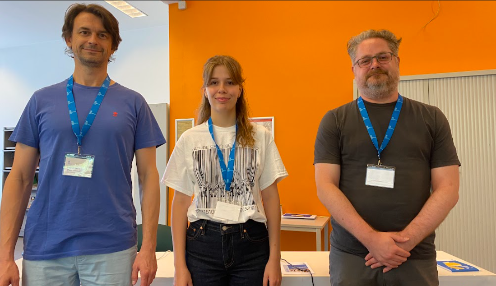
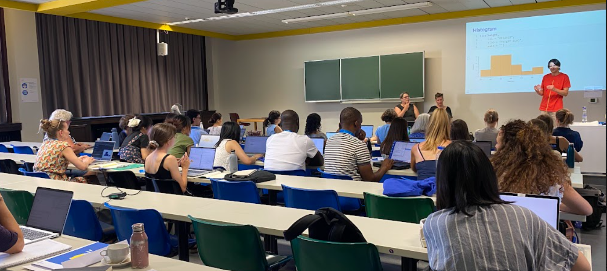

Van 13 tot en met 17 juli 2026 vond aan de UGent de internationale summer school *Methods in Language Sciences* (MILS) plaats. 

Deze summer school is een gezamenlijk initiatief van de vakgroep Taalkunde en de vakgroep Vertalen, Tolken en Communicatie. Samen met Koen Plevoets organiseerde ik het evenement al voor de zesde maal op rij; een mooie traditie in wording.

**Taalonderzoek over de grenzen heen**. De missie van onze summer school is om beginnende (PhD) en ervaren (postdoc) onderzoekers te voorzien van geavanceerde, praktische methodologische kennis en vaardigheden voor hun taalonderzoek. 

Taalwetenschappen omvat een waaier aan domeinen: variatielinguïstiek en taalverandering, grammatica en lexicografie, vertaal- en tolkwetenschappen, eerste en vreemde taalverwerving, fonologie en fonetiek, neuro- en psycholinguïstiek, sociolinguïstiek en pragmatiek, ethnografie, computerlinguïstiek, enzovoort. Statistiek in de linguïstiek? In elke taalwetenschappelijke discipline worden tegenwoordig de meest innovatieve technologieën en geavanceerde statistische modellen toegepast.   

MILS richt zich zowel op onderzoekers van de Universiteit Gent als externe gasten.

Dat doen we via intensieve, praktijkgerichte modules van 15 contacturen, gedoceerd door internationale experts. Met 13 lesgevers mochten we dit jaar maar liefst 97 deelnemers verwelkomen, afkomstig uit 17 landen en 45 verschillende universiteiten.

Het cursusaanbod van MILS 2026 bestond uit:

- Introduction to R
- Introduction to statistics with R
- Natural Language Processing
- Introduction to Python
- PRAAT
- Eye-tracking
- Survey design
- Multivariate data analysis with R
- Regression analysis with R
- Advanced predictive modeling

**Taalwetenschap is STEM**. De klassieke tweedeling tussen 'harde' STEM-vakken en de menswetenschappen is al lang achterhaald. Excellent taalonderzoek kan niet zonder gesofisticeerde wetenschappelijke methodes. Taalwetenschappers zijn hun STEM dan ook nooit verloren. Taalwetenschap is een **S**cience. Taaltechnologie is per definitie een **T**echnologie en een tak van de ingenieurswetenschappen (**E**ngineering), en we gebruiken niet meer of niet minder wiskunde (**M**athematics) dan andere wetenschappers.

**Open lesmateriaal**. Ik doceerde dit jaar de module *Introduction to statistics with R*. Al mijn lesmateriaal (handboek, slides, data) stel ik gratis en openbaar beschikbaar via deze website: <https://ludovicdecuypere.github.io/IntroStats_MILS2026_Site/>

Ook het materiaal van de module *Introduction to R*, die ik de voorbije jaren gaf, staat volledig online: <https://ludovicdecuypere.github.io/IntroR_MILS2026_Site/>

Op naar MILS 2027!