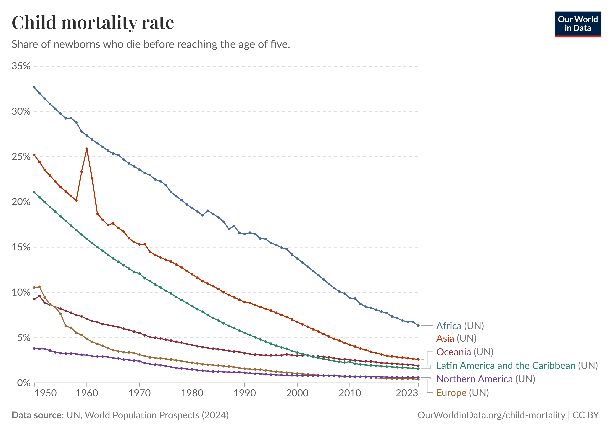
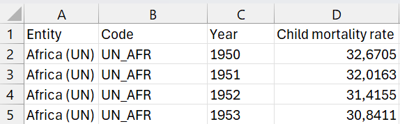
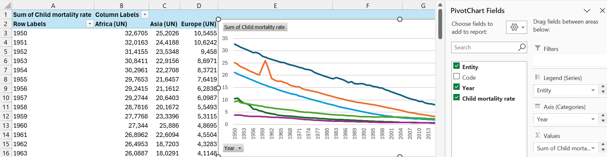
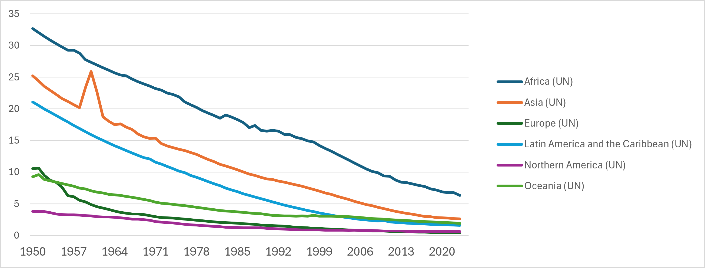
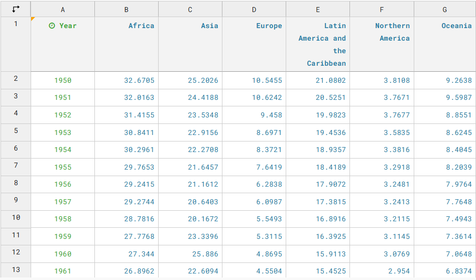
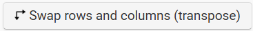

### Evolutie kindersterfte

Aanschouw een van de grootste successen van de afgelopen decennia. 

{#fig-child-mortality-around-the-world}

Kindersterfte - hier gedefinieerd als kinderen die sterven voor ze de leeftijd van vijf jaar bereiken - is sinds de jaren 1950 over de hele wereld spectaculair afgenomen. Vroeger was niet altijd beter. 

De figuur komt van het ongeëvenaarde *Our World in Data* [@Ritchie2018]. 
@tbl-owid-kindersterfte toont de eerste vijf rijen van de dataset waarop @fig-child-mortality-around-the-world gebaseerd is.

|    Entity   |  Code   | Year | Child mortality rate | 
|:-----------:|:-------:|:----:|:--------------------:|
| Africa (UN) | UN_AFR  | 1950 |      32.6705         |
| Africa (UN) | UN_AFR  | 1951 |      32.0163         |
| Africa (UN) | UN_AFR  | 1952 |      31.4155         |
| Africa (UN) | UN_AFR  | 1953 |      30.8411         |
| Africa (UN) | UN_AFR  | 1954 |      30.2961         |

: Data Kindersterfte in Our World in Data [@Ritchie2018]. {#tbl-owid-kindersterfte}

`Entity` is een variabele met zes regio's (Africa, Asia, Oceania, Latin America and the Caribbean, Northern America, en Europe), `Code` is een afkorting voor de Regio en is voor de visualisatie niet relevant, `Year` is het jaartal (elk jaar vanaf 1950 t/m 2023) en `Child mortality rate` bevat de kindersterfte als percentage. De eerste rij interpreteren we als volgt: in het jaar 1950 stierven naar schatting 32,6% van alle kinderen voor hun vijfde levensjaar. Eén op drie kinderen! In 2023 is dit nog 6,3% (1 op 16). Dit is vooruitgang. 

In deze blog bekijken we de relatie tussen het dataformaat en de datavisualisatie. Dezelfde gegevens kunnen immers op verschillende manieren gestructureerd worden. Die structuur bepaalt mee hoe eenvoudig een visualisatie kan worden gemaakt.

Ik visualiseer dezelfde data op drie verschillende manieren: ten eerste in MS Excel, ten tweede in R met het ggplot2-pakket, en ten derde met de online tool Datawrapper. 

Drie verschillende manieren om een dezelfde figuur te maken maar op basis van een ander dataformaat: op basis van het lange en het wijde dataformaat. De dataset in @tbl-owid-kindersterfte volgt het lange dataformaat. 

### MS Excel

In Excel kunnen we starten van de data in het lange dataformaat, zoals in @fig-data-excel:

{#fig-data-excel width="60%"}

We selecteren de data en creëren een interactieve PivotChart (Draaigrafiek); selecter `Insert` (`Invoegen`) en kies `PivotChart` (`Draaigrafiek`). Vervolgens krijg je een lijst met velden die je kunt invullen zoals in @fig-pivotchart-excel. We kiezen `Entity` als Legende, `Year` als X-as en plaatsen `Child Mortality Rate` onder Waarden. Dan krijg je in eerste instantie een staafdiagram, maar je kunt die figuur dan veranderen naar een lijndiagram (rechts klikken op de figuur en selecteer `Change Chart Type` (`Grafiektype wijzigen`). 

{#fig-pivotchart-excel}

Via PivotChart transformeert Excel het lange dataformaat automatisch naar het wijde dataformaat. Vergelijk het lange dataformaat in @tbl-owid-kindersterfte met het wijde dataformaat in @tbl-wijd. In het wijde dataformaat wordt het jaartal in de eerste kolom geplaatst en worden de zes namen van de regio's naar kolommen getransformeerd.

|    Year     |  Africa (UN)   |    Asia (UN) |      Europe (UN)     | 
|:-----------:|:--------------:|:------------:|:--------------------:|
| 1950        | 32,6705        |    25,2026   |        ...           |
| 1951        | 32,0163        |    24,4188   |        ...           |
| 1952        | 31,4155        |    23,5346   |        ...           |
| 1953        | 30,8411        |    22,9156   |        ...           |
| 1954        | 30,2961        |    22,2708   |        ...           |

: Data Kindersterfte in het wijde dataformaat. {#tbl-wijd}

Je zou de data in Excel ook rechtstreeks op die manier kunnen ingeven. Dan heb je geen PivotChart nodig om een lijndiagram te maken.

Na wat bijschaven ziet de figuur in Excel er dan uit zoals in @fig-kindersterfte-excel:

{#fig-kindersterfte-excel}

De figuur vertoont nog enkele onvolkomendheden. Zo kunnen de waarden op de Y-as beter als percentages weergegeven worden. Ook de legende kan met de regio's kan beter weggelaten worden. Het is tegenwoordig gebruikelijk om legendes als deze te vermijden en om de namen van de regio's naast de lijnen te schrijven. Excel is zeer goed, maar levert geen topkwaliteit. 

### R

In R vertrekken we van het lange dataformaat. We openen het CSV-tekstbestand. 

```{r}
cm <- read.csv("child-mortality-around-the-world.csv", 
               stringsAsFactors=TRUE)
head(cm)
```

We maken gebruik van `ggplot2` om een lijndiagram te maken. 

```{r}
#| fig-width: 7
#| fig-height: 5
#| fig-dpi: 450
library(ggplot2)
ggplot(cm, aes(x = Year, 
               y = Child.mortality.rate, 
               color = Entity, group = Entity)) +
  geom_line(linewidth = 0.8) +
  scale_y_continuous(labels = function(x) paste0(x, "%")) + 
  scale_x_continuous(limits = c(1950, 2035)) +
  theme_minimal() +
  theme(legend.position = 'none', 
         plot.subtitle = element_text(
          color = "#4a4a4a",  
          size = 10),
         plot.title = element_text(
          size = 14))  +
  labs(
    title = "Child mortality rate",
    subtitle = "Share of newborns who die before reaching the age of five",
    x = "",
    y = "") +
  annotate(
      "text", x = 2023.5, y = 0.2, 
      label = "Europe",
      size = 2.2,
      color = "grey9",
      hjust = 0) +
  annotate(
      "text", x = 2023.5, y = 0.8, 
      label = "Northern America",
      size = 2.2,
      color = "grey9",
      hjust = 0) +
  annotate(
      "text", x = 2023.5, y = 1.4, 
      label = "Latin America and the Carribean",
      size = 2.2,
      color = "grey9",
      hjust = 0) +
   annotate(
      "text", x = 2023.5, y = 2.0, 
      label = "Oceania",
      size = 2.2,
      color = "grey9",
      hjust = 0) +
   annotate(
      "text", x = 2023.5, y = 2.6, 
      label = "Asia",
      size = 2.2,
      color = "grey9",
      hjust = 0) +
   annotate(
      "text", x = 2023.5, y = 6.3, 
      label = "Africa",
      size = 2.2,
      color = "grey9",
      hjust = 0)

```

### Datawrapper

In Datawrapper maakte ik deze interactieve figuur:

<iframe title="Spectaculaire daling kindersterfte voorbije 70 jaar" aria-label="Line chart" id="Datawrapper-chart-ZhkdE" src="https://Datawrapper.dwcdn.net/ZhkdE/1/" scrolling="no" frameborder="0" style="border: none;" width="746" height="414" data-external="1"></iframe>

Om deze figuur te maken moet je de data structureren zoals in het wijde dataformaat (@tbl-wijd), met het jaartal als eerste kolom en de regio's als extra kolommen. @fig-data-datawrapper toont deze datastructuur in Datawrapper:

{#fig-data-datawrapper}

In feite is nog een tweede mogelijkheid voor het wijde dataformaat. Je zou de Regio's ook als eerste kolom kunnen nemen en de Jaartallen als extra Kolommen, zoals in @tbl-wijd2:

|    Regio     |  1950     |  1951    |  1952 | 
|:------------:|:---------:|:--------:|:-----:|
| Africa (UN)  |  32,6705  |  32,0163 |  ...  |
| Asia (UN)    |  25,2026  |  24,4188 |  ...  |
| Europe (UN)  |  10,5455  |  10,6242 |  ...  |
|   ...        |   ...     |   ...    |  ...  |

: Data Kindersterfte in het tweede wijde dataformaat. {#tbl-wijd2}

Op zich is er niets verkeerds met dit dataformaat, maar het leent zich minder tot een vlotte visualisering. In Datawrapper dien je de data dan eerst te transponeren (rijen worden kolommen en omgekeerd) met de knop {height="1em"}.

### Conclusie

Een mooie datavisualisatie begint met inzicht in de data en het correcte dataformaat. Vele wegen leiden naar Rome en er zijn verschillende manieren om dezelfde figuur te maken. De belangrijkste boodschap is dus om je dataformaten goed te kennen. 

Wetenschappers voegen tegenwoordig een *Data Management Plan* toe aan hun onderzoeksaanvraag. Een bureaucratische overbodigheid volgens sommigen, een cruciale eerste stap volgens anderen. Met het oog op het efficiënt verwerken van de data is het in ieder geval noodzakelijk om op voorhand na te denken over de manier waarop de data tot stand zal komen en hoe de data correct gestructureerd kan worden. Better safe than sorry. 

Tot slot, wat met de olifant in de kamer? Kan genAI dit niet? Jazeker. Maar enige basiskennis is vereist om van `1+1` drie te maken.  


